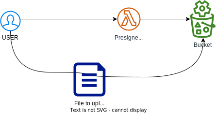
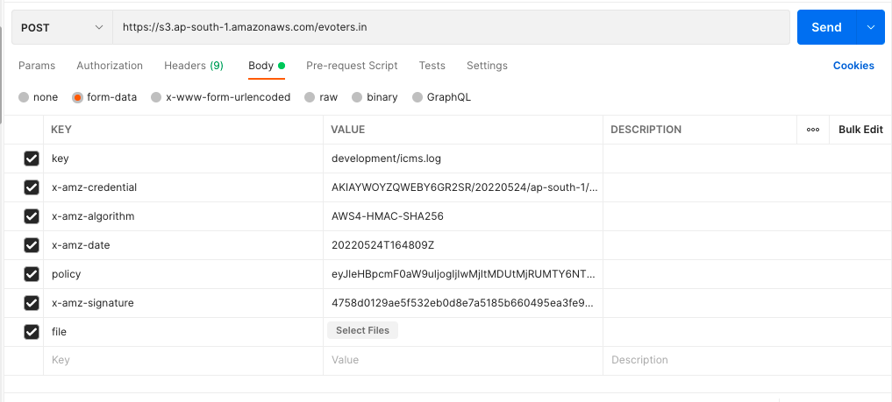

= Create Pre-Signed URL for S3 to upload/download files from S3 bucket.

image::https://img.shields.io/badge/-Python-333333?style=flat&logo=python[Python]

image::https://img.shields.io/badge/-AWS%20Cloud-333333?style=flat&logo=amazon[AWS Cloud]

== Install Dependencies

[source, shell]
----
pip install -r requirements.txt
----

== Run locally

[source, shell]
----
chalice local
----

== Deploy

[source, shell]
----
chalice deploy
----

== Set the value for the following variable before deploy

[source, shell]
----
bucket =
aws_access_key_id =
aws_secret_access_key =
region_name =
----
    
==  Deploy

[source, shell]
----
chalice deploy

chalice deploy --stage=prod
----

== To Run test::

[source, shell]
----
py.test tests/

pytest --log-cli-level=DEBUG
----

== Creating Pre-signed URL for specific version of file
Syntax
[source, shell]
----
{fileName}?versionId={versionId}
----
Example
[source, json]
----
{
    "arguments": {
        "fileName": "icms.log?versionId=Ldsnjdas31k12dfe",
        "bucket": "bucketName",
        "fileEvent": "upload"
    }
}
----

`fileEvent` will decide the URL is for `upload` or `download`.

Upload using `POSTMAN`

 

Make sure `IAM` is configured in home directory

== Troubleshoot

[source, xml]
----
<?xml version="1.0" encoding="UTF-8"?>
<Error>
    <Code>InvalidArgument</Code>
    <Message>a non-empty Access Key (AKID) must be provided in the credential.</Message>
    <ArgumentName>X-Amz-Credential</ArgumentName>
    <ArgumentValue>/20220707/ap-south-1/s3/aws4_request</ArgumentValue>
    <RequestId>VP0VETJW6VMN8V3C</RequestId>
    <HostId>epgbX20fB6B/hfSbTqBnKiaGCFc/Wl6cjPsz+jgtA28lvw6uOJkThmo4PJxINJe+XaOlU2cBCcQ=</HostId>
</Error>
----

=== Solutions

Provide the `environment variable`. `Access & Security` is must. Without key also it will generate the presigned url but it will not have the pass-key in `X-Amz-Credential`

